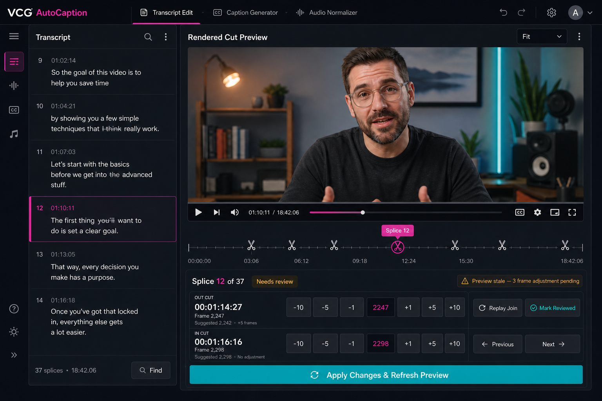
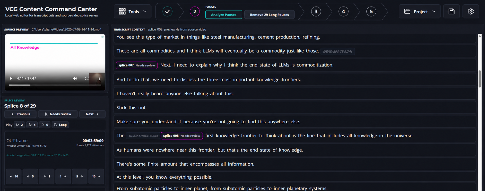

# Active Build Plan

Approved: July 10, 2026.

This plan records the next production work for VCG AutoCaption. The application
is used daily, so changes must remain incremental, backward compatible, covered
by regression tests, and independently reversible.

## Approved Sequence

1. **Cut-plan validation and overlap prevention**
   - Enforce ordered, positive-length kept ranges.
   - Prevent neighboring IN/OUT adjustments from crossing or collapsing a
     range.
   - Validate at adjustment time and again immediately before export.
   - Preserve behavior for every currently valid saved project.
2. **Threshold-aware dead-space removal**
   - Treat Whisper gaps as candidate timing data, not verified silence.
   - Analyze only candidates meeting the configured threshold when the user
     clicks the primary **Analyze Pauses** action.
   - Store Whisper and measured acoustic boundaries separately.
   - Show only measured long-pause chips meeting the configured threshold.
   - Restore previously deleted candidates when measurement rejects them.
   - Make the displayed chips, affected count, and bulk removal use the same
     measured duration.
   - Disable bulk removal while threshold-qualified raw candidates remain
     unanalyzed.
   - Consider retained-pause trimming as a follow-up after threshold behavior is
     tested against production footage.
3. **Audio Boundary Assist**
   - Keep Whisper word start/end timestamps as the immutable baseline for every
     assisted cut anchor.
   - Use Whisper's word boundary as the baseline, then inspect a short audio
     window around that boundary for the actual completion of the spoken word.
   - Preserve the Whisper-suggested frame separately from any assisted frame and
     the user's manual adjustment.
   - Run only when the user clicks the primary **Fine Tune** action, after
     transcript edits have created splices.
   - Analyze only splice OUT points that are still marked unreviewed.
   - Report cuts checked, adjusted, and unchanged; do not report transcript
     word counts.
   - Validate and tune the conservative energy/silence detector against
     representative production clips before changing its limits.
   - Do not use fixed padding or word character count as a proxy for speech
     timing.
4. **Normalization during cut export**
   - Retain the standalone Audio Normalizer.
   - Add an optional processing choice to cut export.
   - Initially compose the proven cut and normalization pipelines sequentially.
5. **Rendered cut preview**
   - First add fast, rendered previews around an individual splice.
   - Then add a full rendered draft with splice markers.
   - Embed OUT/IN adjustment, replay, review, and previous/next controls directly
     in the rendered-preview workspace.
   - After applying adjustments, return playback to the relevant join.
6. **Repeated-phrase transcription investigation — deferred**
   - Do not change Whisper/VAD defaults without representative failure clips.
   - Use examples from a future production recording to determine whether VAD,
     context conditioning, model choice, or conversion loses the phrase.

## Approved Rendered-Preview Direction

The approved screen keeps transcript context visible while making the rendered
video the main review surface. Each cut point displays:

- source timecode in `HH:MM:SS:FF` form;
- absolute source frame;
- the original suggested frame; and
- the manual adjustment delta.

Splice controls remain embedded below the rendered video. Users should not need
to navigate back to another screen to nudge a cut.

## Approved Header Direction

The production header remains a single row. A conventional **Tools** hover menu
contains Transcript Edit, Caption Generator, and Audio Normalizer. Project open,
save, and settings remain compact secondary utilities outside the editing
workflow.

Transcript editing is represented as five connected numbered chevrons. Only the
selected stage expands horizontally:

1. Open Video and Generate Transcript
2. Analyze Pauses and Remove Long Pauses
3. Fine Tune
4. Rendered Preview
5. Export

Collapsed stages show only their number. The expanded stage uses outlined teal
and magenta accents rather than large solid action blocks. Stage 4 remains a
disabled placeholder until the rendered-preview milestone is implemented.

## Production Safety Rules

- Never overwrite source media.
- Keep existing export behavior available until a replacement is verified.
- Apply project-format changes through versioned, backward-compatible loading.
- New output-changing settings default to current behavior for existing files.
- Validate the complete cut plan before invoking FFmpeg.
- Write rendered previews only beneath the ignored temporary directory.
- Keep each milestone independently testable and revertible.
- Run the full Python suite, TypeScript typecheck, and production build before
  considering a milestone complete.
- Test representative landscape and portrait footage before changing defaults.

## Current Milestone

Milestones 1–3 have an initial implementation and automated validation:

- invalid and overlapping plans are rejected and adjustment changes roll back;
- bulk pause removal defaults to `0.8s`, reports the affected count, and keeps
  only threshold-qualified measured pause tokens visible;
- Analyze Pauses measures only threshold-qualified Whisper candidates and
  rejects false long pauses before transcript editing;
- audio boundary suggestions preserve Whisper timestamps while extending OUT
  points only when local audio evidence supports it; and
- project files now write version 2 while version-1 files load with safe
  defaults.

Audio Boundary Assist now runs only from the primary **Fine Tune** toolbar
action after transcript edits create splices. It extracts the source audio once,
examines only outgoing words for unreviewed splices, and checks up to `0.35s`
after each Whisper word end. It extends only when local energy shows continuing
speech and stops at sustained silence or the next word. The splice adjustment
stores the original Whisper frame, assisted suggestion, and manual nudge as
separate values. Representative production footage is still required to
validate and tune the conservative detector.

### Superseded proposal

An initial fixed word-tail-padding implementation was added on July 10, 2026
without approval. It was removed the same day because it changed every eligible
OUT point rather than intelligently locating spoken-word completion. Fixed
padding and character-count timing are not part of the approved plan.
