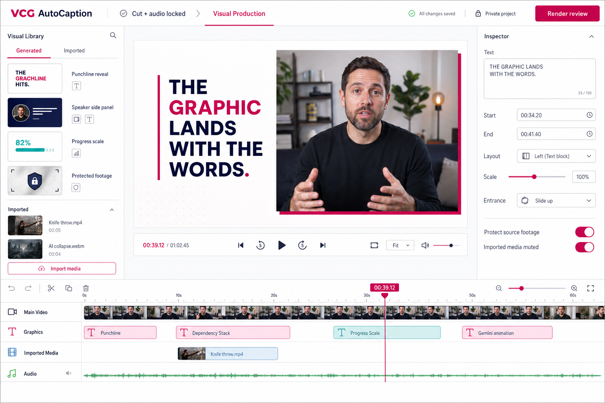
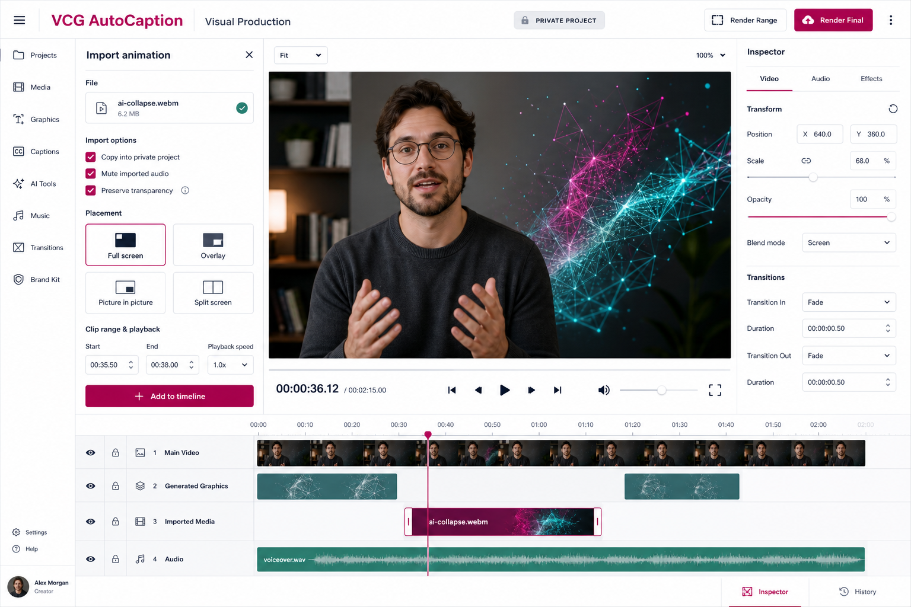

# Visual Production Workflow

Status: one contract, enforced in code and covered by tests, July 25, 2026.

This document is the product contract for the separate Visual Production
workflow. **The Current Contract section below is the only authority.** Four
earlier dated contracts are preserved verbatim in the History appendix at the
end; they describe how the system used to behave and must not be followed.

The approved Creator Library, B-roll, Pexels, candidate-review, and stock
provenance expansion is specified in
[Visual Storytelling Assets](visual-storytelling-assets.md).

## The Current Contract

Everything in this section is enforced by code. Where prose and code disagree,
the code is right and the prose is a bug.

**One document per role.** `visual-suggestions.json` is the decision record:
what was proposed, why, and what the creator approved. `visual-plan.json` is the
execution record: what renders. The plan is never authored directly. Every
enabled cue carries `planningSuggestionId` naming the approved suggestion that
authorised it, and a cue without one blocks delivery.

**One contract version.** `coverage.reuseAudit.contractVersion` must be `3`.
Lowering it used to switch off the approval contract, the planning gate, and the
library harvest at once; it is now rejected outright. `coverage.reuseAudit.reviewed`
must be `true`. A plan containing authored graphics without a coverage block is
rejected.

**Loop A gates the review render.** Cook proposes; the creator reviews one
representative still frame per graphic and approves it or rejects it with notes.
Notes route back through the revision prompt. When every scene is approved,
`canRenderReview` opens.

**Loop B gates delivery.** The approved plan renders as a review pass, is
watched against the full cut, and is approved or noted. `canDeliver` requires
`fullReviewApproved`, and any edit to the plan invalidates that approval, so a
fix made in response to a note is reviewed again rather than inheriting the
sign-off. There is no route to a delivered render that skips either loop.

**Treatment swaps are re-approved.** A Loop B note may replace the treatment
entirely. An approved decision whose `selectedTreatmentId` no longer matches the
suggestion's `moduleId`/`recipeId` is rejected: the swap needs its own approval.

**Speaker geometry is measured, not declared.**
`visual-production/layouts/scene-geometry.json` records the speaker rectangle for
all eight recording layouts. Seven are computed from the OBS scene collection;
`full-screen-talking` is measured from delivered footage because its camera
source is uncropped. A suggestion reporting a `speakerBounds` that disagrees with
the measured value is rejected, and overlay collision is arithmetic against the
measured rectangle. The Cook prompt renders the same table from the same file.

**Every graphic is an overlay.** `maxSpeakerAbsenceSec` must be exactly `0`.
There is no full-frame takeover mode. The speaker-safety rules have exactly one
implementation, shared by the suggestion validator and the production gate.

**Namespaces do not cross.** `moduleId` names something the renderer executes
today; `recipeId` names a catalog entry that still needs realizing. An
unrecognised treatment raises an error naming it; it is never substituted with a
generic side panel.

**The plan is bound to its cut.** The plan records the SHA-256 of the locked cut
its cue times were authored against. A re-cut is reported as an explicit
mismatch naming the affected cue count, and blocks rendering.

**The schemas are executable.** `visual-plan.schema.json` and
`visual-suggestions.schema.json` run on every read and write. Domain rules run
first so errors name the rule; the schema runs second so nothing escapes.
Suggestion items reject invented fields.

**The library compounds from production outcomes.** A treatment is harvested
only when it rendered as an enabled cue with no unresolved review note against
it — the Loop B outcome, not the Loop A approval. The canonical preview Cook
ranks against is the highest-rated use, not the most recent. After delivery the
creator is prompted to rate exactly the treatments this video introduced. A
harvest that fails is reported as a failure and never folded into a zero.

## Cook Operating Detail

Operating detail for cooking, previewing, approving, and building a VCG visual
plan. This section elaborates The Current Contract above; it is not a separate
authority and does not create a contract version, schema family, planning file,
review surface, or render path.

Where this section conflicts with The Current Contract, The Current Contract
controls.

### Fixed terminology and counts

Use these terms consistently in files, prompts, UI labels, reports, and
conversation:

- **Timeline decision**: one proposed interval in `visual-suggestions.json`.
  Its category may be graphic, clean speaker, protected footage, Creator
  Library media, project media, stock, or AI footage.
- **Graphic treatment**: one continuous authored visual composition serving one
  editorial idea. A long treatment remains one graphic treatment even when it
  contains many reveals or layout states.
- **Meaningful visual change**: a state change that advances understanding,
  attention, or emphasis. It is not automatically a new graphic treatment or
  timeline decision.
- **Internal change**: a meaningful visual change inside an existing graphic
  treatment, such as the next bullet, chart state, UI action, callout, speaker
  move, or conclusion emphasis.
- **Intentional clean-performance hold**: an explicitly planned source-footage
  interval where a visible performance, gesture, reaction, or demonstration is
  itself the visual.
- **Protected-footage decision**: a source interval that graphics must not
  obstruct because the footage contains an authored joke, demonstration,
  animation, important gesture, reaction, or emotional delivery.
- **Historical treatment evidence**: a real approved frame from prior VCG use of
  the selected treatment. A generic illustration is not historical evidence.
- **Sample frame**: one still rendered specifically to show a proposed treatment
  when historical treatment evidence is unavailable.
- **Unresolved approval**: any active timeline decision whose creator decision
  is not approved.

Never report one of these counts as another. A status summary must label, at
minimum, total timeline decisions, graphic treatments, intentional
clean-performance holds, protected-footage decisions, B-roll decisions, and
unresolved approvals. Do not present a combined number as “graphics.”

### One workflow and one source of truth

Use this path only:

`Cook Visual Plan -> Review every proposal -> Approve or request revision -> Build approved treatments -> Review the live registered composition -> Export final`

Use the private `visual-suggestions.json` as the planning and approval record,
then build accepted decisions into the private `visual-plan.json`. Do not create
an alternate storyboard, disconnected HyperFrames project, second approval
queue, or parallel delivery state.

The Scene Analyst, Scene Selector, Producer, and Variation Agent are four
mandatory sequential responsibilities inside the one Cook Visual Plan
operation. They are not optional routes and they may not independently replace
the contract:

1. **Scene Analyst** inspects the actual locked footage and word-timed
   transcript, identifies protected source moments, records scene geometry and
   spoken beats, and proposes the editorial job and internal change
   opportunities.
2. **Scene Selector** hard-filters registered modules, proven recipes, private
   Creator Library records, ratings, locked defaults, and preview evidence
   against the scene layout and protected regions, then records at least three
   ranked compatible candidates for each graphic treatment.
3. **Producer** chooses the best compatible ranked treatment or records a
   structured bespoke gap. It may not silently substitute an easier generic
   card, omit an unsupported interval, or reduce later-video coverage.
4. **Variation Agent** audits the complete proposal set for family and treatment
   repetition, intentional series, B-roll coverage, source-footage protection,
   and final-third creative stamina.

Each responsibility must write its required evidence into the same suggestion.
Later responsibilities may reject and return an incomplete suggestion to the
previous responsibility, but they may not create another planning path.

### Visual cadence and treatment duration

The single controlling cadence rule for every VCG video is:

> After each meaningful visual change, the next meaningful visual change must
> begin within five seconds, unless the plan identifies an approved intentional
> clean-performance hold.

This is a maximum unchanged duration. It is not a required graphic duration,
scene duration, cut frequency, or graphics-per-minute quota.

A graphic treatment may remain on screen for as long as its editorial idea
requires. Progressive reveals, chart changes, UI actions, speaker movements,
emphasis changes, and other meaningful internal states reset the five-second
clock. A long treatment remains one treatment; do not divide it into separate
graphics merely to satisfy the cadence rule.

A meaningful visual change must advance the viewer's understanding, attention,
or emphasis. Qualifying changes include:

- revealing a new bullet, step, comparison, or conclusion;
- changing chart data, workflow state, or demonstrated UI;
- introducing or changing a relevant callout;
- meaningfully rearranging the composition;
- moving or resizing the speaker to support new information;
- cutting to a relevant supporting visual;
- using one deliberate punch zoom or reframe to change emphasis; and
- entering or exiting a treatment.

The following do not qualify:

- ambient drift or decorative looping motion;
- an unchanged graphic remaining on screen;
- captions appearing over otherwise unchanged footage;
- idle cursor movement;
- repeated zooming on the same composition; or
- minor motion that does not communicate anything new.

Use no more than one punch zoom before changing to another visual device. The
next device may be an internal reveal, callout, speaker reframe, UI action,
chart change, supporting visual, new treatment, or approved clean-performance
hold.

Permit an intentional clean-performance hold only when the visible performance,
gesture, reaction, or demonstration is itself the planned visual. Timestamp,
name, justify, and show it in the approval plan. An unplanned gap, missing
asset, unfinished graphic, or default source-footage segment does not qualify.

Do not introduce another cadence standard. Graphics-per-minute counts,
five-second timeline slices, fixed scene lengths, and mandatory numbers of
separate graphics must not be used as approval gates. The five-second
meaningful-change rule is the only cadence gate.

### Full-runtime planning record

Inspect the full locked cut and transcript before saving suggestions. Cover the
entire runtime with explicit timeline decisions; do not author only the opening
or stop when a target number of graphics has been reached.

For every graphic treatment, record:

- exact start and end time;
- editorial purpose and transcript context;
- source layout and representative source-frame time;
- spoken beats and conclusion timing;
- every planned meaningful internal change and its timestamp;
- setup, maximum-occupancy, resolved, and exit states;
- speaker placement and protected regions through the fully developed state;
- selected treatment, visual family, candidates, and selection rationale; and
- approval-preview evidence.

For every clean-performance hold, record its exact interval, representative
source frame, visible performance reason, and explicit approval state. For every
protected-footage interval, record the protected action and the time by which
competing graphics must clear.

The cook must also complete reuse, variation, and B-roll audits across the full
runtime. B-roll may be marked not suitable with a concrete reason; it may not be
silently omitted.

### One-frame pre-render approval evidence

Provide one approval comparison for every proposed graphic treatment:

1. show the actual locked-video source frame from that scene; and
2. show the selected treatment evidence beside it.

Use a real approved historical treatment frame when an appropriate one exists.
The historical frame may be reused as evidence for multiple compatible scenes,
but every proposal must still show its own actual source frame and
speaker-safety result.

When appropriate historical treatment evidence does not exist, render exactly
one representative sample frame for that proposal. Use the treatment's
maximum-occupancy or otherwise most collision-sensitive state. Missing
historical evidence therefore triggers a sample-frame task; it does not justify
a generic illustration, silent substitution, omitted proposal, or full
production render.

Generic illustrations may remain in library browsing to explain an unbuilt
recipe, but they do not satisfy approval evidence and must never be labeled as
prior VCG usage or as a sample of the proposed scene.

Internal reveals must be listed with timestamps but do not require separate
approval images. One representative comparison is the approval surface for the
treatment. Render no review video or full scene merely to make the planning
decision.

Do not allow approval until the selected treatment has valid historical
evidence or its required sample frame, the actual scene source frame is
available, and the speaker-safety record passes.

### Speaker-safety approval

Measure speaker and protected-content geometry from the actual locked footage,
not from a presumed lower-third or corner template. Validate setup, every
internal state that changes occupied area, the maximum-occupancy state, the
resolved state, and exit.

Record every opaque overlay region rendered above the speaker. Reject any
intersection with protected speaker geometry. A side-by-side approval
comparison must display the speaker-safety result and identify the state used
for maximum-occupancy validation. Sustained graphics must preserve the speaker
in a validated container; a brief full-frame hit may hide the speaker for no
more than two continuous seconds.

### Reuse and variation

Reuse systems, atoms, and motion grammar rather than completed scenes:

- do not use the same completed layout more than twice unless the repetition is
  an explicitly documented callback or intentional series;
- do not place the same visual family on consecutive graphic treatments;
- do not use repeated punch zooms as coverage;
- do not reduce visual variety or meaningful-change cadence in the final third;
- preserve an intentional series ID, rationale, and group approval when
  repetition carries meaning; and
- validate reused layouts against the current scene's copy, geometry, and fully
  revealed state rather than inheriting old bounds or wrapping.

### Binding approval and build-through

Allow the creator to approve the selected treatment, reject it with durable
notes, request another candidate, or approve a declared intentional series.
Keep rejection history.

Treat the accepted treatment ID, family, layout, speaker placement,
speaker-safety record, internal-change ledger, and preview evidence as an
implementation contract. Do not substitute another treatment or family during
build. Return any required substitution to `revision-requested`.

Build only after all timeline decisions are resolved. Every built cue must
retain its planning suggestion ID, approved treatment ID, selected family,
ranked candidate IDs, selection rationale, speaker-safety record, internal
change timestamps, and approval-evidence reference.

Before final export, reject:

- an unplanned unchanged gap longer than five seconds;
- an unapproved or unevidenced graphic treatment;
- an undocumented clean-performance hold;
- a built cue that differs from its approved treatment map;
- speaker absence longer than two continuous seconds;
- overlay intersection with protected speaker geometry;
- a conclusion or punchline that becomes readable before its spoken timing;
- consecutive use of one visual family without an approved series rationale;
- treatment use beyond the reuse limit without an approved exception;
- transition flashes, clipping, accidental wrapping, or hidden readable states;
  and
- materially weaker authorship in the final third.

### Implementation status

Implemented in the working tree on July 24, 2026 through the existing Approval
Contract Three path:

- Cook is one sequential operation and writes one suggestion file;
- the application computes fixed decision counts and a full-runtime,
  five-second meaningful-change audit;
- long treatments preserve timestamped internal reveals instead of being split;
- clean-performance and protected-footage holds require typed reasons;
- every graphic carries treatment-bound approval evidence;
- Review accepts only a real historical render or one exact representative
  sample frame, never a generic recipe illustration;
- the app can render the one-frame sample for registered modules, while an
  unbuilt recipe is returned to Cook to create its exact one-frame
  implementation sample rather than being silently approximated;
- approval requires matching evidence and speaker safety;
- build preserves cadence and evidence records in the registered cue;
- production gates reject incomplete coverage, cadence gaps, pending approval,
  missing evidence, mismatched treatments, and dropped audit data; and
- schema, prompt, backend, UI, and regression coverage enforce the contract.

## Product Boundary

Visual Production begins only after the source cut and audio are locked. It is
not another control inside transcript-cut review and it must not change source
timing, splice decisions, transcript edits, or locked-cut audio.

The end state replaces CapCut as the final assembly environment for this
workflow. VCG AutoCaption should take a locked video through generated graphics,
imported animations, overlays, transitions, review, and final render without a
separate NLE.

This does not mean reproducing every Premiere Pro or CapCut feature. The product
should implement the finishing operations this creator workflow actually uses.

## Goals

- Suggest visual opportunities from the final timestamped transcript and source
  footage.
- Keep every suggestion editable and reproducible without another AI request.
- Provide a growing library of reusable, parameterized graphics.
- Allow one-off creative treatments whenever the existing library is not enough.
- Import animations created with Grok, Gemini, Sora, After Effects, or other
  tools and place them on the same timeline as generated graphics.
- Preserve authored visual jokes, demonstrations, reactions, and animations in
  the source footage.
- Save and reopen a complete private visual project.
- Render selected ranges for fast review and the complete final video locally.
- Improve the reusable system after every production rather than attempting to
  design the complete library in advance.

## Current Round-One Product

Implemented in the current working tree:

- `visual-production/brand/vcg-white-editorial.json`;
- `visual-production/styles/vcg-white-editorial.css`;
- `visual-production/modules/catalog.json`;
- `visual-production/schemas/visual-plan.schema.json`;
- `scripts/new_visual_project.py`;
- `scripts/check_repo_privacy.py`;
- a GitHub privacy workflow and locally installed pre-commit privacy hook;
- the private local Codex skill `$vcg-visual-producer`.
- a separate Visual Production workspace in the Tools menu;
- private project creation, open, save, media streaming, and version-one plan
  validation;
- all five initial generated modules rendered through local HyperFrames;
- imported video, animation, and image copying into the private project;
- a layered browser timeline, playhead preview, cue inspector, protected-footage
  ranges, and range selection;
- background selected-range and full-video render jobs with pinned local
  HyperFrames, GSAP, FFmpeg, and FFprobe dependencies.

Round one is deliberately a focused finishing workflow, not a complete NLE.
The July 16 canonical-runtime decision supersedes the static React imitation as
an authoritative preview and supersedes version-one frozen-master asset cues as
the representation of a custom composition. Numeric overlay controls remain;
direct manipulation returns only when it can edit the registered HyperFrames
composition without creating another preview path. Automatic transcript
suggestion UI and a generalized user-authored module builder remain future
evolution.

## Inspector and Render Ownership

The Inspector edits or reviews plan-backed objects only:

- registered generated-module cues;
- registered custom-composition scene cues;
- imported image and video cues; and
- planning suggestions and their review notes.

Registered cues, custom compositions, and imported assets render from
`visual-plan.json`. Every Review or Final render must synchronously save the
current browser plan before the render job starts; the autosave debounce alone
is not sufficient. A planning
suggestion is explicitly **not rendered** until Codex realizes it as a
registered module cue, composition cue, or imported overlay asset and writes
that result back to the private project. A disconnected custom HyperFrames
folder is not an acceptable synchronized result.

The Inspector must label whether the selected item is **Plan-backed and
renderable** or **Planning only**. Reload Files remains the explicit way to read
Codex-authored changes immediately, with focus refresh as a convenience.

Image and video import must be visible as a labeled **Import image/video**
action, not only an icon. Import copies the source into the private project,
places it at the current playhead, selects it, and exposes numeric Inspector
controls. The exact runtime preview remains authoritative.

## Parent Project and Codex Handoff

Superseded decision: Visual Production no longer creates a disconnected private
project when a parent video project is active. Standalone visual projects remain
available only for legacy compatibility. New videos begin with a private
`project.vcg-project.json` parent created in Phase 1, and the visual plan lives
inside that project.

After `exports/locked-cut.mp4` and the cut-timeline-remapped
`transcripts/final-transcript.json` exist, choose
**Project > Cook Visual Plan Prompt**. The generated prompt is ready to paste
into Codex and includes every supporting path plus the VCG editorial and privacy
constraints. Its first pass is suggestions-only: inspect footage and transcript,
mark protected footage, propose exact reveal timing, and wait for approval
before writing cues or rendering.

## VCG Visual Direction

The fixed brand inputs are Montserrat and the VCG palette:

- white as the dominant editorial canvas;
- deep navy `#1A1A2E` for primary text;
- magenta `#FF00CE` for conclusions and emphasis;
- accessible magenta `#C700A1` where contrast requires it;
- teal `#007C7D` for structure, evidence, and navigation.

White-first is a direction, not a prohibition. Dark, footage-led, or atmospheric
scenes remain available when the content earns them. Avoid generic dark
AI-product styling, repetitive floating SaaS cards, and motion that exists only
to decorate the frame.

## Two Equal Visual Sources

### Generated modules

Generated graphics are deterministic, parameterized treatments rendered from a
saved plan. The initial public catalog contains:

- `punchline-reveal`;
- `source-footage-hold`;
- `speaker-side-panel`;
- `progress-scale`;
- `dependency-stack`;
- `dual-comparison`, for two colored option columns around a centered square speaker crop.

These are the starting vocabulary, not a closed template menu. A private project
may use a new experimental treatment before it is added to the public catalog.
Once a treatment proves useful, remove all video-specific data and promote its
generalized module, rule, or style.

### Imported media

Existing animations and assets are first-class timeline clips, not references
that must be assembled later in CapCut. The implemented importer accepts:

- MP4, MOV, and WebM video;
- transparent WebM or MOV where supported;
- still images;
- GIF files as imported visual media;
- video audio when explicitly enabled; broader music, sound-effect, transparent
  MOV, and Lottie support remain follow-up work.

Imported assets default to muted so the locked main-video audio remains
authoritative. Users may deliberately enable asset audio.

An imported clip needs editable controls for:

- timeline start and end;
- source in/out trimming;
- playback speed and looping;
- full screen, overlay, picture-in-picture, or split-screen placement;
- position, scale, crop, rotation, and opacity;
- layer order and blend mode;
- entry and exit transitions;
- transparency, background removal, or chroma key where appropriate;
- whether the main video remains visible underneath.

Assets should be copied or frozen into the private project so moving an original
download does not break a saved production.

## Private Project Model

Create a safe project with:

```powershell
.\.venv\Scripts\python.exe scripts\new_visual_project.py my-video
```

The default root is `%USERPROFILE%\Videos\VCG Projects`. Set
`VCG_PRIVATE_WORKSPACE` to choose another location. The command refuses to
create a private project inside the Git checkout.

The intended private shape is:

```text
my-video/
  .vcg-private
  source/
  transcript/
  assets/
  plans/
    visual-plan.json
  working/
  renders/
```

The saved visual plan references project-relative assets and contains the
complete deterministic composition:

```text
Main video
├── Protected source-footage ranges
├── Generated graphics
├── Imported animation and image clips
├── Text and callout overlays
├── Transitions
└── Optional music and sound effects
```

AI may suggest the first plan, but editing, reopening, previewing, and rendering
that plan must not require more AI tokens.

## Approved Workspace Direction

The Visual Production workspace is separate from cut/audio finishing and has
four primary regions:

1. **Visual Library** — generated modules and private imported assets.
2. **Preview** — accurate composited playback of the selected moment or range.
3. **Inspector** — text, timing, layout, transform, animation, audio, and
   transition controls for the selected clip.
4. **Layered timeline** — main video, generated graphics, imported media, and
   audio tracks with a shared time axis.

The interface must make common work possible without AI:

- drag or add a visual to the timeline;
- change text and parameters;
- move and trim a clip;
- change module or placement mode;
- adjust scale, position, opacity, speed, and transitions;
- disable, duplicate, reorder, or protect a clip;
- preview the current moment or selected range;
- save, reopen, and render.

### Concept: main workspace



### Concept: importing an external animation



These images communicate information architecture and visual direction. They
are not pixel-perfect implementation contracts and include generic placeholder
footage rather than proprietary creator material.

## Transcript and Footage Analysis

The transcript supplies exact word-level timing, but it is not the only source
of truth. Planning must inspect the footage before placing overlays.

The planner should produce:

- suggested visual moments;
- exact start and end timing;
- module or imported-asset choice;
- editable text and parameters;
- protected source-footage ranges;
- the reason each visual earns its place.

Protected ranges include authored animations, visual jokes, demonstrations,
important gestures, and reactions. Graphics must clear before the protected
action begins.

## Editorial Contract

- Never reveal a punchline before its spoken delivery.
- Setup text may appear early only when it does not disclose the conclusion.
- Begin a punchline reveal with the corresponding spoken word and finish no
  earlier than the completion of the phrase.
- Reveal names, credentials, statistics, and list items with their spoken
  introduction unless the user explicitly requests a teaser.
- Let authored footage communicate its own visual jokes and demonstrations.
- Move the speaker into a bounded container before a side panel becomes
  readable.
- Keep the speaker visible full-screen or in a container; do not hide the
  speaker for more than two continuous seconds.
- Never wash a translucent panel or gradient across the speaker's face.
- Animate data from an unresolved state toward its spoken conclusion.
- Alternate full-frame graphics, framed footage, overlays, and clean source
  holds instead of repeating one card pattern.

## Evolution and Learning

After feedback, classify each note as:

- a universal editorial rule;
- a reusable module improvement;
- a brand preference;
- a video-specific exception.

Update the private plan immediately. Promote the first three only after removing
names, transcript text, timestamps, paths, screenshots, and media. Keep
video-specific exceptions private.

The public catalog represents patterns that have earned reuse. The private
workspace remains the creative laboratory. HyperFrames is the current renderer,
but the plan and module contracts should not prevent future Lottie, Three.js,
WebGL, Remotion, or other rendering implementations.

## Round-One Vertical Slice

The previously published 60-second pilot remains the development and acceptance
fixture. This round does not include processing its complete 14-minute source.

Round one is complete when the application can:

1. Load the private 60-second locked video and transcript.
2. Create or open its `visual-plan.json`.
3. Display generated and imported visuals on a layered timeline.
4. Implement the five initial generated modules.
5. Import at least one external Grok/Gemini-style animation.
6. Place, trim, transform, mute, and transition both visual types without AI.
7. Mark and respect protected source-footage ranges.
8. Preview the current moment and a selected range.
9. Save, close, and reopen the project without losing reproducibility.
10. Render the finished 60-second MP4 without CapCut.

The approved V2 pilot is the behavioral reference: spoken reveals are not
spoiled, the knife animation remains unobstructed, speaker side panels use a
container, and the top-percentile scale grows toward its target.

## Deferred Work

Do not expand round one to include:

- completing or republishing the 14-minute video;
- a large module marketplace;
- cloud rendering or collaboration;
- full Premiere/CapCut feature parity;
- advanced freeform keyframe editing;
- automatic module promotion;
- every possible media codec or effects runtime;
- Lottie, Three.js, WebGL, or Remotion integration before the core media and
  deterministic-render path is proven.

## Privacy Gates

The public repository contains only reusable application behavior, schemas,
content-neutral modules, sanitized documentation, and privacy tooling. Creator
material belongs outside the checkout:

- videos, transcripts, and `.vcg.json` projects;
- imported animations, images, music, and sound effects;
- per-video visual plans and storyboards;
- snapshots, intermediate frames, and renders.

Run before every public push:

```powershell
npm run privacy:check
```

The checker rejects private directories, creator-media formats, transcript
artifacts, personal absolute paths, and oversized tracked files. It also scans
historical paths because deleting a private file in a later commit does not make
the earlier commit safe to publish.

## Library curation and canonical defaults

Treatment records include purpose, family, exact allowed layouts, content
capacity, motion profile, reuse policy, private preview availability, creator
rating, default-lock state, lock scopes, and use history. The Rate tab presents
each unique approved or built treatment once after a video.

Ratings and locks are separate:

- 5: excellent/default candidate;
- 4: preferred;
- 3: usable;
- 2: needs refinement and is not normally suggested;
- 1: retained in history but excluded from normal reuse; and
- **Lock as default**: canonical first choice for a compatible intent/scope.

`numbered-step-intro` is the initial five-star locked default for the intent
“Example number and title.” It uses intentional-series reuse when multiple
examples appear in one video. A future variant may challenge a locked default,
but it becomes canonical only through explicit promotion; the previous version
remains in history.

## Delivery audio evidence

Stage 5 records whether normalization actually ran. When it did, the record
includes preset, target loudness, measured source loudness, and the measurement
point. Final Visual Production export stream-copies the locked-cut audio,
verifies packet identity, and writes `visual-production/delivery-manifest.json`
with audio normalization evidence, source and delivered packet hashes, channel
and sample-rate details, plus delivered video metadata. The UI calls this
“locked-cut audio” unless normalization or mastering is proven by that record.

---

# History: superseded contracts

The sections below are kept for provenance only. Each was the authority on its
date and has been superseded by The Current Contract above. **Do not follow
them.** Where they conflict with the current contract, they are wrong.

## SUPERSEDED — Canonical Revision and Production Contract - July 16, 2026

The blocking review-build sequence in this section was superseded by the
July 20 export contract below. The schema-v2 revision model, exact-runtime
preview, voice timing, and automated layout requirements remain in force.

`visual-plan.json` is the one source of truth for authoring, review, reopening,
and delivery. Schema version two records:

- registered custom HyperFrames compositions and their source hash;
- plan-backed composition scene cues with stable scene IDs;
- every visible semantic item's `spokenStartSec`, `fullyVisibleSec`, phrase,
  and anchor type;
- numbered revisions containing the active HyperFrames source, entry file,
  review render, final render, plan hash, and artifact checksums; and
- representative approval, full-review approval, strict layout inspection, and
  delivered-revision reopen verification.

The Visual Production preview embeds the registered HyperFrames player and
composition. The MP4 review render is a separately labeled comparison view; it
does not replace or imitate the authoring runtime. Preview and render therefore
resolve the same composition directory and entry file.

Production gates are blocking. A full review build requires representative
scene approval for the current plan hash, no unanchored visible text, and no
composition-root overflow exemption. Final delivery additionally requires a
current full review render, explicit full-review approval, and successful
HyperFrames lint, validation, and strict layout inspection at every semantic
item's `fullyVisibleSec` voice anchor (plus ordinary timeline samples). This
checks readable states instead of hidden outgoing DOM at hard cuts. A custom
composition cue may have an empty semantic list only when it has no visible
text, such as a clean tail hold. Delivery is incomplete until reopening Visual
Production displays the delivered runtime and records the matching revision
number and plan hash.

## SUPERSEDED — Direct Final Export Contract - July 20, 2026

The live registered HyperFrames composition is the creator's full review
surface. Once all active review notes are accepted or resolved, **Export final**
is the only required export action. Representative approval, a separate full
review MP4, full-review approval, and a post-delivery approval are no longer
prerequisites for final export.

One click now saves the current plan and performs the complete delivery job:

- prevents a second render from starting for the same project and reconnects
  the UI to the existing job;
- persists stage, percentage, elapsed time, estimated remaining time, failure,
  and output path so a browser reload keeps the export visible;
- runs HyperFrames lint, validation, and strict layout inspection at the
  voice-anchored readable states before rendering;
- renders the registered composition once at final quality;
- stream-copies the locked cut's audio into the rendered video;
- verifies encoded video, duration, frame rate, frame count, audio presence,
  audio format, and full-length audio packet identity before publication; and
- atomically publishes `exports/final-video.mp4`, or uses a timestamped final
  filename when Windows has the existing target open.

The export is rejected if active review notes remain, visible semantic items
are unanchored, composition-root overflow suppression is present, the plan
changes during rendering, or the completed media fails verification. Legacy
gate and review-render fields remain readable for existing projects but no
longer block **Export final**.

## SUPERSEDED — Approved Review and Sync Expansion - July 14, 2026

The Visual Production workspace is the shared source of truth between the
creator and Codex while a visual pass is being revised. The approved expansion
adds these behaviors without changing locked-cut timing or redesigning the
renderer:

- Dock a review-note editor below the right-hand Inspector for the selected
  timeline item.
- Provide a note field plus **Leave everything else** and **Replace all of it**
  checkboxes. The two checkboxes are mutually exclusive. With neither checked,
  the note requests a targeted change to the selected item.
- Treat a non-empty note as **Changes requested**. After Codex writes the next
  revision back to the project, the item becomes **Ready for review**.
- Provide an **Accept** action that removes the active review marker while
  preserving an immutable accepted-note record in project history. Editing or
  adding another note starts a new review round.
- **Copy All Notes** includes only items with non-empty active notes. It includes
  project and plan paths, exact timestamps, stable item IDs, item types, notes,
  and preservation scope. It explicitly protects every unnoted scene.
- Save plan edits back to the private project automatically and provide a clear
  reload path for changes written by Codex or HyperFrames. The browser editor
  and the files Codex reads must not become parallel sources of truth.
- Show B-roll opportunities and AI-footage briefs as distinct colored timeline
  lanes even before media is attached. These are planning items, not fake
  rendered clips.
- Let imported images and video overlays be dragged and resized directly on the
  preview while retaining the existing numeric controls.

Review records live with the private visual plan. An active record identifies
one cue or suggestion, contains its exact timing and directive, and has status
`changes-requested` or `ready-for-review`. Accepted records move to durable
review history so end-of-project analysis can separate universal editorial
rules, reusable treatment improvements, brand preferences, and one-video
exceptions.

The Generated panel has two explicit meanings:

- **Ready** contains implemented modules that can be inserted and rendered now.
- **Reusable recipes** contains proven content-neutral treatments that are not
  installed render modules yet. Each recipe is labeled **Needs Build**. Hovering
  shows a visual preview; **Build with Codex** creates an exact timestamped
  planning item, creates a scoped review note, and copies its build/reuse prompt.
  It does not silently switch the user to another panel.

Successful new treatments move from **Needs Build** to **Ready** only after a
real generalized implementation exists. This distinction keeps the reusable
animation library discoverable without weakening the renderer contract.

Clarification approved July 14, 2026: the earlier whole-card click that created
a suggestion and jumped directly to Review was confusing and is superseded.
Recipe cards must explain their state and expose an explicit build action. A
library-browsing preview may use the most recent private production thumbnail
when one is available; otherwise it may use a content-neutral illustrative
fallback so every recipe remains understandable without creator media in Git.
That illustrative fallback is browsing help only. Under the canonical Cook and
Approval Contract, it is not valid approval evidence; a proposal without
historical evidence requires one representative sample frame.

## SUPERSEDED — Approval contract three

The Canonical Cook and Approval Contract above defines the controlling cadence,
evidence, counting, sequential-responsibility, and build-through rules for this
contract. The summary below does not create a second interpretation.

All new Visual Production projects use the same eight layout labels:
full-screen talking; talking on the left; talking on the right; talking in the
bottom-left; talking in the top-left; talking in the bottom-right; talking in
the top-right; and computer screen only.

Each planning suggestion carries a `scenePacket`. It records the layout,
representative source-frame time, actual speaker geometry, protected screen
regions, transcript/spoken beats, purpose, content density, motion
opportunities, B-roll fit, series identity, and surrounding constraints. A
graphic scene also carries at least three ranked library candidates. Candidate
ranking applies hard layout and protected-region compatibility first, then
exact intent, locked canonical status, creator rating, proven use, content and
motion fit, and variation needs.

The Review tab shows the source-frame screenshot beside the selected historical
treatment frame or required representative sample frame. A generic recipe
illustration cannot satisfy proposal approval. The creator can choose among
ranked candidates, approve the choice, reject it with durable notes, request a
new alternative, or approve an intentional series together. **Next unresolved**
advances through decisions still awaiting agreement. No full render or final
export is allowed until every active planning decision is approved and carries
the required evidence and speaker-safety result.

The built cue must retain `planningSuggestionId`, `approvedTreatmentId`, the
speaker-safety record, selected family, compared candidates, and selection
rationale. A changed treatment reopens the decision; production may not
silently substitute another family.
